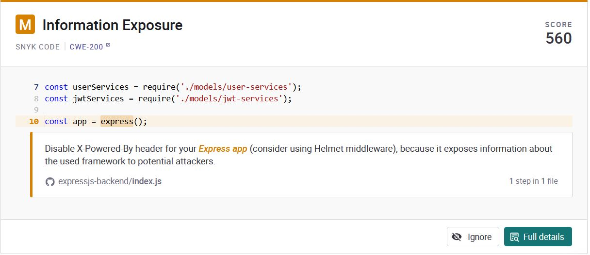
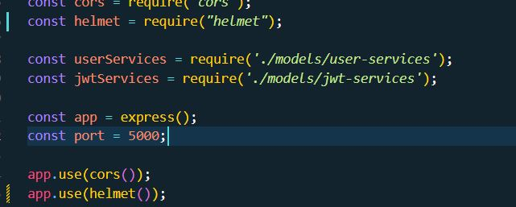

# Project for CSC424 class
This a simple application that was created for Cal Poly's CSC424 Software Security class. Entire project was created with the React framework used MongoDB as it's database. 

# Lab 3 Notes
## Vunerabilites Fixed
### 1) Information Exposture
 

This was fixed with the following code edits below

### 2)

# Setting Up the Project
## HTTPS
### Frontend
HTTPS is enabled for Windows only, if another OS is used, the package.json file might need to change. It's important to note that you will need to generate your own certifications for the project. These can be stored in a folder called "reactcert" in react-frontend folder.

### Backend
As far as I know, HTTPS is enabled for all operating systems. Again, to start the project certifications are needed so these will need to be generated. These files are stored in a folder called "cert" in the express-backend folder.

## Envrionmental Variables
This project uses a file called ".env" to hide secrets. One of them is a TOKEN_SECRET that is used for generating the JWT token. This means that you will have to create your own .env file with a TOKEN_SECRET in the express-backend folder

## Database
This project uses a local database MongoDB. This requires for you to have MongoDB installed on your computer. 

# Instructions

## Installation
1.  Clone the repo: `git clone https://github.com/HRen5577/csc424-react-app`
2.  Move into the repo's directory: `cd csc424-react-app`
3.  Move into backend `cd express-backend`
4.  Install dependencies with Node: `npm install`
5.  Move into backend `cd ./../react-frontend`
6.  Install dependencies with Node: `npm install` 

## Starting the Project
Assuming you are at the root folder
### Start the backend
1. `cd express-backend`
2. `node index.js`

### Start the frontend
3. `cd ./../react-frontend`
4. `npm start`

### Personal note
Creating the SBOM
`npx @cyclonedx/cyclonedx-npm --output-format json --output-file cyclonedx_fe_sbom.json`
